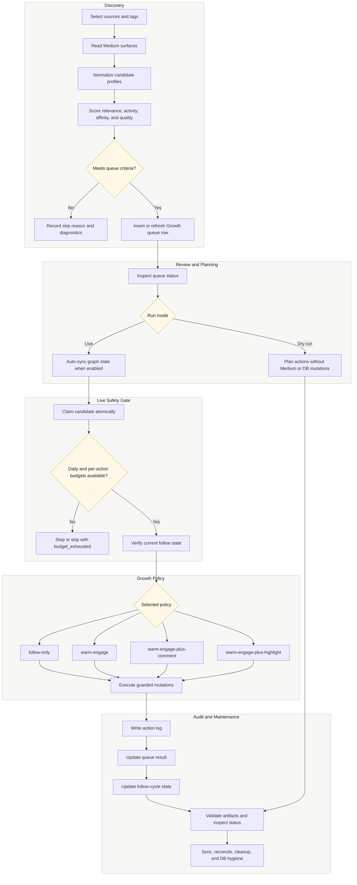

# Medium Stealth Bot

> **Local-first Medium growth automation** for disciplined discovery, warm engagement, queue-driven execution, and operator-controlled account maintenance.

<p align="center">
  <a href="#features"><strong>Features</strong></a> •
  <a href="#quick-start"><strong>Quick Start</strong></a> •
  <a href="#how-it-works"><strong>How It Works</strong></a> •
  <a href="#safety-first"><strong>Safety</strong></a>
</p>

<p align="center">
  
  
  
  
  <br>
  
  
  
</p>

---

## Why Medium Stealth Bot?

Medium growth is most effective when discovery, engagement, and follow-up are deliberate. Medium Stealth Bot gives operators a local command center for finding relevant writers, preparing a reviewed Growth queue, and executing conservative engagement policies with clear limits.

It is built for writers, creators, and technical operators who want automation without handing account data to a hosted service.

- **Discover** relevant writers using transparent scoring and queueing
- **Engage** through warm policies that can include follows, claps, comments, and highlights
- **Maintain** healthy follower ratios with cleanup and reconciliation workflows
- **Control** execution with local-only data, dry-run modes, budgets, and a kill switch
- **Audit** activity through logs, queue state, database records, and run artifacts

The core principle is simple: you control the automation. Auth, queue data, browser profile, and operational artifacts stay on your machine.

---

## Quick Start

### Prerequisites

- Python 3.12+
- [`uv`](https://github.com/astral-sh/uv) package manager
- Playwright Chromium
- Medium account with an active session

### Install & Run

```bash
# 1. Clone the repository
git clone https://github.com/moalimirinfinity/Medium-Stealth-Bot.git
cd Medium-Stealth-Bot

# 2. Install dependencies
uv sync --group dev
uv run playwright install chromium

# 3. Configure your environment
cp .env.example .env

# 4. Setup and launch
uv run bot setup
uv run bot start
```

The interactive start menu guides you through discovery, growth, unfollow, maintenance, diagnostics, and observability workflows.

---

## Features

### Smart Discovery Pipeline

- **Multi-source candidate collection:** topic recommendations, seed followers, target-user followers, publication adjacency, and active responders
- **Transparent scoring:** follow-back likelihood, topic affinity, activity signals, newsletter availability, Medium presence, and source quality
- **Queue-first design:** only execution-ready candidates enter your Growth queue, capped at 700 rows by default
- **Inspectable learning data:** score breakdowns are stored for auditability and conservative follow-cycle learning

### Growth Execution

Choose your engagement style:

| Policy | Description | Best For |
| --- | --- | --- |
| `follow-only` | Follow selected queue candidates without pre-follow engagement | Simple network building |
| `warm-engage` | Read, clap, then follow | Lightweight relationship building |
| `warm-engage-plus-comment` | Read, clap, add a humane comment, then follow | High-value outreach |
| `warm-engage-plus-highlight` | Read, clap, highlight a deliberate span, then follow | Thoughtful content engagement |

`warm-engage-plus-rare-comment` is still accepted as a deprecated alias for `warm-engage-plus-comment`.

### Intelligent Maintenance

- **Cleanup-only unfollow:** remove non-reciprocal follows after configurable windows
- **Graph sync:** keep local follow-state aligned with Medium
- **Reconciliation:** verify ambiguous follow states before relying on them
- **DB hygiene:** prune stale operational data with retention windows

### Safety First

- **Local-only operation:** auth, queue, and artifacts stay on your machine
- **Explicit dry-run modes:** preview actions before going live
- **UTC day-boundary budgets:** enforce daily action caps for follows, claps, comments, highlights, and unfollows
- **Live state verification:** re-check follow state immediately before mutation
- **Claim-safe execution:** candidates are atomically claimed before live execution
- **Kill switch:** `OPERATOR_KILL_SWITCH=true` stops operations
- **Contract validation:** capture-backed Medium API contracts help catch drift

### Observability and Diagnostics

```bash
uv run bot queue
uv run bot status
uv run bot observe validate-artifact
uv run bot probe --tag programming
uv run bot contracts --tag programming --no-execute-reads
```

---

## How It Works



1. **Discover:** collect candidate profiles from configured Medium surfaces, normalize the data, score fit and activity, then queue only candidates that meet the configured thresholds.
2. **Review:** inspect the Growth queue before execution. Discovery does not perform follows, claps, comments, or highlights.
3. **Plan:** run Growth in dry-run mode to see the intended actions without changing Medium, the action log, queue state, or follow-cycle records.
4. **Execute:** live Growth claims each candidate immediately before mutation, checks daily budgets, verifies current follow state, then applies the selected policy.
5. **Record:** every live result is written to local state so queue decisions, follow-cycle history, and operational artifacts remain inspectable.
6. **Maintain:** graph sync, reconciliation, cleanup, and DB hygiene keep local state aligned and manageable.

Run discovery first, then growth. This separation keeps candidate selection auditable and execution controlled.

---

## Configuration Highlights

Start from `.env.example` and tune the parts that match your account and pacing:

```env
# Growth strategy
DEFAULT_GROWTH_POLICY="warm-engage"
LIVE_SESSION_DURATION_MINUTES="90"
LIVE_SESSION_TARGET_FOLLOW_ATTEMPTS="120"

# Discovery tuning
DISCOVERY_ELIGIBLE_PER_RUN="100"
GROWTH_CANDIDATE_QUEUE_MAX_SIZE="700"
DEFAULT_GROWTH_SOURCES="topic-recommended,seed-followers"

# Safety budgets
MAX_ACTIONS_PER_DAY="100"
MAX_SUBSCRIBE_ACTIONS_PER_DAY="250"
MAX_CLAP_ACTIONS_PER_DAY="500"
MAX_COMMENT_ACTIONS_PER_DAY="8"
MAX_HIGHLIGHT_ACTIONS_PER_DAY="8"

# Graph sync
GRAPH_SYNC_AUTO_ENABLED="true"
```

Full config docs: [`.env.example`](.env.example) • [`docs/RUNBOOK.md`](docs/RUNBOOK.md)

---

## Ethical Use Guidelines

This tool is designed for controlled, operator-directed growth automation. Please:

- Use it to discover and engage with genuinely relevant content
- Review Medium's current [Terms of Service](https://medium.com/policy)
- Start with `--dry-run` to preview decisions and actions
- Monitor account health and tune pacing conservatively
- Do not use it for spam, deceptive engagement, or mass-follow churn

**Disclaimer:** You are responsible for how you use this tool. The authors assume no liability for account actions, automation decisions, or platform policy changes.

---

## Common Workflows

### Fill the Growth Queue

```bash
uv run bot discover --live --source topic-recommended --source seed-followers --tag programming
uv run bot queue
```

### Run a Dry Growth Pass

```bash
uv run bot growth cycle --policy warm-engage-plus-comment --dry-run --no-auto-sync
```

### Run a Live Growth Session

```bash
uv run bot growth session --policy warm-engage --session-minutes 90 --target-follows 120
```

### Run Maintenance

```bash
uv run bot sync --live --force
uv run bot reconcile --dry-run --limit 200 --page-size 50
uv run bot cleanup --dry-run --limit 50
uv run bot maintenance db-hygiene --dry-run
```

---

## Project Structure

```text
Medium-Stealth-Bot/
├── src/medium_stealth_bot/  # Core Python package
├── scripts/                 # Utility scripts
├── ops/scheduling/          # Cron and automation helpers
├── docs/                    # Runbooks, policies, release guides
├── captures/                # API contract artifacts
├── .env.example             # Configuration template
└── pyproject.toml           # Project metadata and dependencies
```

---

## License

Distributed under the **MIT License**. See [`LICENSE`](LICENSE) for details.

---

## FAQ

**Q: Is this against Medium's ToS?**

A: You should review Medium's current policies before running any automation. This project is designed around local control, dry-runs, pacing, and operator-visible decisions, but responsible use is still your responsibility.

**Q: Will my account get banned?**

A: Generally speaking, **no**, but no automation tool can guarantee zero risk. Medium's enforcement is nuanced and evolves over time.

**Q: Can I run this on a server or VPS?**

A: Yes, but auth cookies and local data will live on that machine. Secure `.env`, browser profile, and SQLite files carefully.

**Q: How do I update?**

A: Run `git pull && uv sync`, then check [`docs/RELEASE.md`](docs/RELEASE.md) and recent commits for operational changes.
